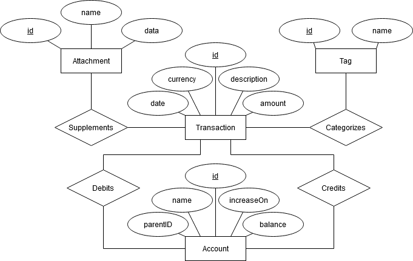

# reledger - Design
This document explains the design of reledger and discusses design decisions made during
development.

## Double-Entry bookkeeping
reledger will use the double-entry bookkeeping system, since it is a proven system that has been
used for centuries and is simple but still very flexible.

The main accounts in double-entry bookkeeping are:
- Income: An abstraction of the money that comes from the outside world. For example from an
employer or from other people.
- Expenses: Money that is transferred to the outside world. The opposite of income.
- Assets: Money that you own and can use.
- Liabilities: Money that you owe. Debts.
- Equity: Your "net worth". It's the money you own when you start using reledger. Typically, your
first entry would take money from Equity and put it into Assets and the other accounts.

In double-entry bookkeeping, each recorded transaction should have a "from" account (credit) and a
"to" account (debit). Since no account ever has negative values, depending on the type of account,
debiting and crediting may either increase or decrease the value of the account. For example,
crediting "Income" increases its value but crediting "Assets" decreases its value.

An account by itself does not have a "balance", since the balance of an account is determined
entirely by the transactions that involve it.

## Relational Data Model
In order to provide support for flexible queries on transaction data, reledger will use a relation
data model. This will also aid in development of new features -- for example limiting queries to a
range of dates -- as the DBMS will do a lot of the heavy lifting. Another advantage to this is that
it allows application developers or advanced users to run their own SQL queries on the data.

### Considerations
#### Account Heirarchy
The accounts should be able to be categorized into arbitrary subaccounts, and a query on an account
should include all of its subaccounts. Of course, we cannot have a list of subaccounts as an
attribute on the Account entity, as that would violate first normal form.

The obvious, naive approach is to let each Account track it's immediate parent. Like so:
`Account(id, parentID)`

This is a simple approach that would work, but it would make it painful to write queries to select
subtrees. If you wanted to select an account and all of its subaccounts, you would first have to
select the account, then select the children with a parentID that equals the selected account's ID,
and then for each child select that childs children with the parentID that equals that childs ID,
and so on until you've found all subaccounts.

There are many patterns to solve this problem, like Adjacency Lists, Path Enumeration or
Materialized Path, but all of these have drawbacks that make them unsuitable for certain operations.
A simple pattern without any major drawbacks is using a Closure Table. It simply records the
ancestors and descendants in a separate relation: `Ancestor(ancestor, descendant)`

By adding this table, if you need to get an account and all its subaccounts, you just select the
rows in the Ancestor table where the ancestor equals the account id.

#### Attachments
For the attachments, we need to figure out how they are to be stored in the database. They will most
likely be images or PDFs, but should they be stored as binary blobs, or as file paths?

The main advantage that I see to using blobs is that it is easier to maintain integrity of the data.
By copying it into the database as a binary blob, the database has control over whether the copy is
removed or changed. If the database only stores a file path, it may be able to detect if the file is
changed or deleted through checksums, but it cannot prevent it from happening.

Advantages to file paths is that it leaves managing of files to the file system, which is after all
best at just that. It is also easier to manage a short string of text than it is to manage binary
image data, which are often tens of millions of bytes.

reledger will use binary data, as the integrity of the data is a priority.

### The Model

Transaction is the main entity in the model. Its attributes are:

- id: This is required, as no combination of the other attributes uniqely identifies a transaction.
- date: The date that the user specifies that the transaction occurred on.
- amount: The amount of transferred value between accounts.
- currency: The currency of the transferred value.
- description: Description to help the user identify the transaction.

Transaction has two entities related to it: Attachment and Tag.

Any number of Attachments can be provided for a given transaction to supplement it. This can be
things like receipts or invoices, and are in image or PDF format. The attributes for Attachment are:

- name: weak key for the attachment, used to help the user identify the attachment.
- data: binary data of the file.

As shown by the Tag entity, the user can also specify any number of tags for a transaction in order
to aid in categorizing transactions. Tag only has one attribute, the key attribute name.

Transaction has two relationships to the entity Account: Debits and Credits. Debit is the account
that the value is transferred to and Credit the account that it is transferred from. A transaction
can have one and only one debited account as well as one and only one credited account.

Account has one attributes, name, which is the identifier for the account. The name is a
dot-separated series of strings that shows the heirarchy of the account, where the first string
must be one of the following: "Income", "Expenses", "Assets", "Liabilities" or "Equity". The strings
can contain any character except the delimiting dot. An example of a name is Liabilities.CSN.Student
loan, which shows that the account is a child of Liabilities.CSN and a grandchild of Liabilities.

The name is just a way to visualize the heirarchy to the user, it is not what actually determines
the heirarchy once it is stored in the database (though it will be used to initially create the
heirarchy and put it in the database). For this, the AncestorTo relationship is used. This is the
Closure Table discussed in [Account Heirarchy](#account-heirarchy), and is what will allow selecting
all descendants of an account to be painless. What the relationship describes is that an Account can
be a ancester to any number of other Accounts -- i.e. sub accounts --, and a sub account can be a
direct or indirect descendant of any number of Accounts. The AncestorTo relationship has two
attributes of which both are keys.

## Database Schema

